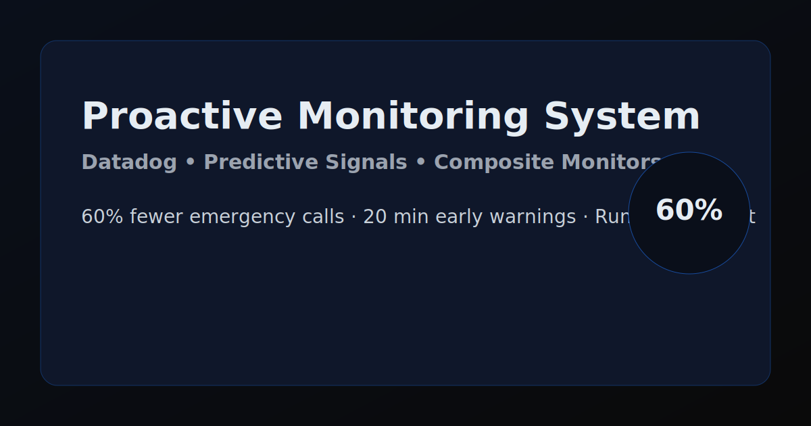
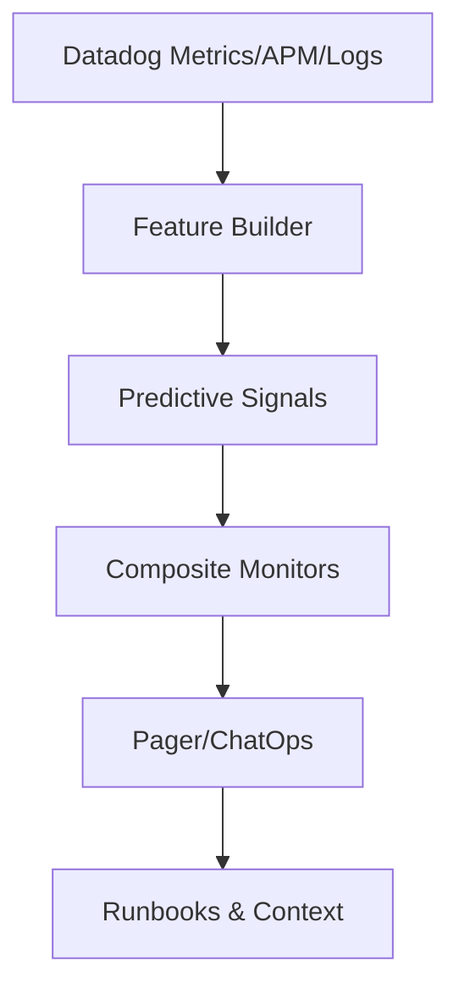

# Proactive Monitoring System — Case Study

Datadog-powered predictive monitoring that surfaces incidents 20 minutes before impact, resulting in 60% fewer emergency support calls.

<picture>
  <source media="(prefers-color-scheme: dark)" srcset="assets/social-preview.svg">
  
</picture>

## Overview
- Objective: move from reactive alerts to predictive detection
- Approach: feature engineering on time‑series metrics, anomaly thresholds, and ML‑assisted signals
- Result: 60% reduction in emergency incidents; earlier detection windows of ~20 minutes

## Highlights
- Unified signals from APM, Infrastructure, and Synthetics
- Predictive windows tuned per service SLOs
- Auto‑generated incident context with top suspects and past remediation notes

## Architecture
- Data sources: Datadog Metrics, APM traces, Logs
- Processing: scheduled workers build features (rolling p95 latency, error deltas, saturation trends)
- Alerts: composite monitors with safety hysteresis and dedup keys



## Implementation Notes
- Composite monitors to avoid noisy flaps (latency + errors + saturation)
- Historical baselines per hour‑of‑day/day‑of‑week
- Auto‑remediation hooks for safe, idempotent actions
- Attach links: dashboards, recent deploys, ownership, and runbooks

## Repository Structure
```
monitoring-dashboard/
├─ assets/
│  └─ social-preview.svg
├─ runbooks/
│  └─ incident-context-template.md
└─ README.md
```

## Getting Started
- This repository is case‑study focused — implementation code is summarized to protect client context.
- Use the incident context template to standardize investigations.
- Questions? Open an issue or reach out: david@cs-learning.me

## License
MIT © David Ortiz
